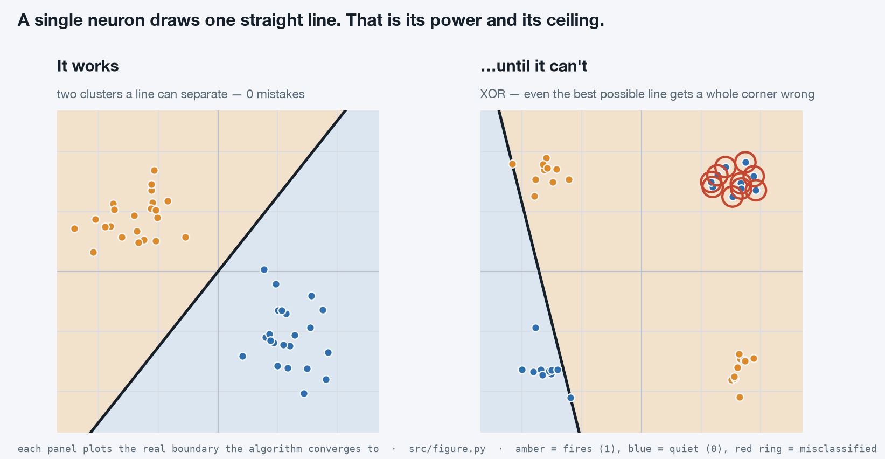

# The Neuron — the unit an LLM is built from

### Part 1 of *AI, from first principles*: the single idea underneath every large language model, explained from scratch — with a playground you can run and code for every claim.



> **There's a playground for this.** Open [`index.html`](index.html) in any browser
> (just double-click it — no install, no server). Press **Run** and watch one neuron teach itself
> to separate two groups of dots. Then load **XOR** and watch it hit a wall it can't cross.
> Everything below explains what you're seeing.

---

## Start with an umbrella

Here's a decision you make without thinking: do I take an umbrella?

You weigh a few things. Dark clouds — counts for a lot. Forecast says rain — counts for a lot. Felt a bit humid — counts for a little. You add up the evidence, and if it crosses some personal tipping point, you grab the umbrella.

That is a neuron. Not a metaphor for one — that is *mechanically* what the unit does. And that unit, repeated millions of times over, is what every large language model is built from. Strip away the scale and the jargon, and the thing doing the work is this small.

Most explanations bury that under notation. This one won't. We'll build the intuition, watch one run, and only then look at the (genuinely short) code.

---

## What one neuron does

Give the neuron some inputs — just numbers. It does three things:

1. **Weigh each input.** Every input gets a *weight* — a number saying how much it matters, and in which direction. "Dark clouds" gets a big positive weight; "it's a weekday" gets roughly zero.
2. **Add them up, plus a bias.** Multiply each input by its weight and sum them. Then add one more number, the *bias* — the neuron's baseline lean before any input arrives.
3. **Check the line.** If the total is positive, the neuron **fires** → outputs **1**. Otherwise it stays **quiet** → outputs **0**.

```
sum = w₁·x₁ + w₂·x₂ + … + b
output = 1 if sum > 0 else 0
```

A weighted sum, then a yes/no. Everything the neuron "knows" lives in those weights and that bias. In the playground, they're shown live in the **readout** panel, ticking as the neuron learns.

---

## Why that's a line

Here's the part that makes it click. The rule "fire when `w₁·x₁ + w₂·x₂ + b > 0`" is, geometrically, a straight line splitting the plane in two.

- On one side, the sum is positive — the neuron fires (1).
- On the other, it's negative — the neuron stays quiet (0).
- Exactly on the line, the sum is zero — the knife's edge.

The weights control the line's **tilt**; the bias **slides** it toward or away from the center. In the playground, the amber region is where the neuron fires and the blue region is where it stays quiet — watch that shaded boundary swing as the numbers change.

So "training a neuron" and "moving a line until it separates the dots" are the same sentence. Hold onto that.

---

## How it learns: be wrong, then nudge

The neuron isn't handed its weights. It finds them itself, and the rule is shockingly simple. Start with a flat, useless line (all weights zero). Then walk through your examples one at a time:

1. **Guess.** Run the point through the three steps above.
2. **If the guess is right, change nothing.**
3. **If it's wrong, nudge.** Move each weight a small step in the direction that would have gotten *this* point right, and nudge the bias too.

The nudge is one line of arithmetic. With `error = target − guess` (which is +1 or −1 on a mistake):

```
wᵢ ← wᵢ + learning_rate · error · xᵢ
b  ← b  + learning_rate · error
```

**Why does that work?** Say a point should have fired (target 1) but the neuron stayed quiet (guess 0). Then `error = +1`, and we *add* the point's coordinates to the weights — so next time, its sum is a little larger, nudged toward firing. If it fired when it shouldn't have, `error = −1`, and we subtract. Every mistake shoves the line one small step toward getting that point right.

The `learning_rate` just sets how big each shove is. And there's a guarantee worth knowing: **if a line separating the two groups exists at all, this stumbling little rule is proven to find one, in a finite number of steps** (Rosenblatt's convergence theorem, 1962). You don't have to take it on faith — press **Run** on any separable dataset and watch the misses drop to zero.

---

## Go watch it

Open [`index.html`](index.html) for a minute.

- **Two clusters / Diagonal** → press **Run**. The line sweeps in and the misses hit 0.
- **Add your own points** → click empty space to drop dots, then Run. However you scatter two groups, if a line *can* separate them, the neuron finds it.
- Drag **Learning rate** and **Speed** and re-run to feel how each changes the path to the answer.

Every dataset above shares one thing: a straight line *can* separate it. Which raises the obvious question — what happens when one can't?

---

## The ceiling: XOR

Load **XOR** and press Run. The misses never reach zero. The line lurches back and forth, forever.

XOR wants the neuron to fire when its two inputs *differ* and stay quiet when they *match*. Look at that arrangement (the right panel of the figure up top): the two "fire" groups sit on opposite diagonal corners, and the two "quiet" groups on the other diagonal. There is no straight line with both fire-groups on one side and both quiet-groups on the other. The figure shows the *best* line a neuron could possibly manage — found by brute force, not training — and even it leaves an entire corner on the wrong side.

This isn't the algorithm being slow. It's a hard geometric wall: **one neuron draws one straight line, and one straight line cannot express XOR.**

---

## From one line to a language model

The fix is almost silly in hindsight: use more than one neuron.

Wire a *layer* of neurons together and their outputs can be combined into a boundary that **bends**. Stack more layers and it can bend into nearly any shape at all — this is the [universal approximation](https://en.wikipedia.org/wiki/Universal_approximation_theorem) property. Do that with **millions** of neurons, tuned by **hundreds of billions** of adjustable numbers (GPT-3, for scale, has ~175 billion of them across ~5 million neurons), train it on a huge slice of the internet, and the thing that began as "should I take an umbrella" becomes something that writes working code and answers almost anything.

That's the engine inside a large language model: the same tiny decision-maker, copied and stacked until the shapes it can draw get unimaginably complex.

**Three honest caveats, so this isn't hand-waving:**

- A real network neuron softens the hard yes/no into a **smooth curve** (activations like GELU or SwiGLU), so that the "nudge" can be computed with calculus.
- It learns by a cleverer method than the rule above — **backpropagation** — which figures out how to nudge weights buried deep inside a stack of layers.
- And a modern LLM adds another mechanism on top of stacked neurons — **attention** — which lets these units share information across a whole sentence. That's a later post.

But the unit doing the work in every layer is exactly the one you just played with: weigh the inputs, add them up, fire if they cross a line. The real atom, not a toy.

---

## The code — all 30 lines of it

The playground and this whole post run on [`src/neuron.py`](src/neuron.py), which uses no libraries at all. The forward pass:

```python
def predict(weights, bias, point):
    total = bias
    for w, x in zip(weights, point):
        total += w * x
    return 1 if total > 0 else 0
```

And the learning rule — the entire "intelligence" — is just: guess, and on a mistake, nudge.

```python
guess = predict(weights, bias, point)
error = target - guess          # +1, 0, or -1
if error != 0:
    for i in range(len(weights)):
        weights[i] += lr * error * point[i]
    bias += lr * error
```

Run it and you'll see AND solved in two passes and XOR give up after a hundred:

```bash
python3 src/neuron.py
```

If you can read those two snippets, you understand the unit an LLM is built from — the real thing, not a simplified cartoon of it.

---

## Run everything yourself

```bash
# the interactive playground — no dependencies, just open it
open index.html          # (or double-click the file)

# the reference implementation — pure Python, no libraries
python3 src/neuron.py

# regenerate the figure at the top of this page
pip install -r requirements.txt
python3 src/figure.py
```

---

## Where this sits

This is the foundation of a series that works from this one unit up to modern models, one genuinely-understood idea at a time. The single neuron here becomes a *layer*, layers *stack* into a network, and the trick that lets you train those hidden layers — backpropagation — is what turns this small idea into something that can write code.

But it all starts with one line, moving until it's right.

## Sources & further reading

- Rosenblatt, F. (1958). *The Perceptron: A Probabilistic Model for Information Storage and Organization in the Brain* — [Psychological Review](https://psycnet.apa.org/record/1959-09865-001)
- [Universal approximation theorem — overview](https://en.wikipedia.org/wiki/Universal_approximation_theorem)
- [How GPT-3 spends its 175B parameters](https://www.lesswrong.com/posts/3duR8CrvcHywrnhLo/how-does-gpt-3-spend-its-175b-parameters) (where the neuron / parameter counts come from)
- [3Blue1Brown — Neural Networks (visual intuition)](https://www.3blue1brown.com/topics/neural-networks)

---

**Next → Why one line wasn't enough: the XOR wall, and the fix everything since is built on.**
